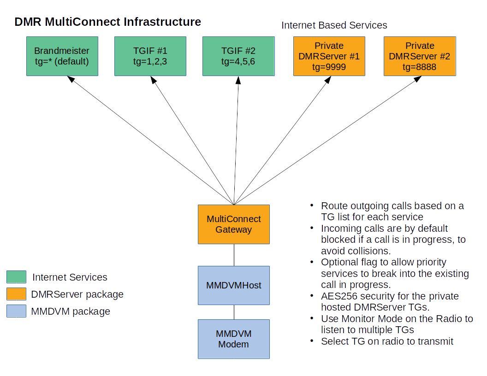

The DMRServer package contains a talk group host for private DMR Talkgroups, and a MultiConnect 
Gateway to allow the MMDVM hotspot product to effective handle multiple DMR Services.  This 
allows seamless use of multiple DMR providers like BM and TFIG, along with private TG hosts.

See: Architecture.png

Coming soon: Encryption from the MultiConnect gateway to the DMRServer TG hosts.

-----------------------------------------------------------------------------------------------

Review the multi_connect.ini and MMDVM.ini files for configuration.

MultiConnect Gateway Usage:  java -jar DMRMultiConnect.jar

#for debug output add the dmr.logger.level flag

java -Ddmr.logger.level=2  -jar DMRMultiConnect.jar -config multi_connect.ini

-----------------------------------------------------------------------------------------------

DMRServer private talkgroup host 

-----------------------------------------------------------------------------------------------

Features:

-Host your own talkgroups on a private server

-No talkgroup configuration, we pass everything through

-Individual or sharded accesss passwords

-----------------------------------------------------------------------------------------------

Prerequisites:

You must have java installed to use this product.  You can type: java -version  at the command line to see if you have this.

-----------------------------------------------------------------------------------------------

Usage:

java -jar DMRServer.jar -port 62031

-----------------------------------------------------------------------------------------------

Authentication 

You must configure auth.properties in order to start the server.

-----------------------------------------------------------------------------------------------

Example 

[auth.properties]

#create a wildcard password for all users

*=xxxxx12345

#create a password for a spoecific DMR Id

1234567=xxxxx12345

#create a password for a DMR Id + any ESSID

1234567*=xxxxx12345

#create a password for a DMR Id + ESSID "01"

123456701=xxxxx12345
